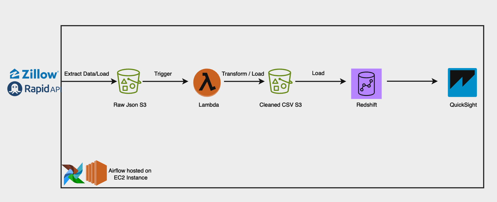

# Zillow Data ETL Pipeline Project

## Overview

This project demonstrates an end-to-end ETL (Extract, Transform, Load) pipeline utilizing a variety of AWS services to achieve a robust and scalable data processing workflow. The pipeline extracts real estate data from Zillow's API, processes and cleans the data, and loads it into Amazon Redshift for analysis and visualization using Amazon QuickSight.

## Architecture

1. **Data Extraction**: Apache Airflow is used to schedule and manage the extraction of data from the Zillow API. Airflow orchestrates the entire ETL process, ensuring tasks are executed in the correct sequence.
2. **Data Storage**: Raw JSON data is stored in an S3 bucket, providing a durable and scalable storage solution.
3. **Data Transformation**: An AWS Lambda function is triggered by S3 events when new raw data is uploaded. This function processes the JSON data, transforming it into a cleaned CSV format and storing it in a separate S3 bucket.
4. **Data Loading**: The cleaned CSV data is loaded into Amazon Redshift using Airflow. Redshift provides a high-performance, scalable data warehouse solution.
5. **Data Visualization**: Amazon QuickSight is used to create interactive and insightful visualizations from the data stored in Redshift, enabling users to derive meaningful business insights.

## Components

### Apache Airflow

- **Task Orchestration**: Manages the workflow of the ETL pipeline, including data extraction, processing, and loading tasks.
- **DAG (Directed Acyclic Graph)**: Defines the ETL workflow, scheduling, and dependencies between tasks.

### AWS S3

- **Raw Data Storage**: Stores the raw JSON data extracted from the Zillow API.
- **Processed Data Storage**: Stores the cleaned CSV data after transformation by the Lambda function.

### AWS Lambda

- **Data Transformation**: Processes the raw JSON data, extracting relevant fields, and converting it into a cleaned CSV format.
- **Event-Driven Processing**: Triggered by S3 events to automate the data transformation process.

### Amazon Redshift

- **Data Warehousing**: Provides a high-performance, scalable environment for storing and querying large datasets.
- **Data Loading**: Receives the cleaned CSV data from S3 for efficient querying and analysis.

### Amazon QuickSight

- **Data Visualization**: Creates interactive dashboards and reports, enabling users to visualize and explore the data stored in Redshift.

## Benefits

- **Scalability**: Leverages AWS services to handle large volumes of data efficiently.
- **Automation**: Uses Apache Airflow and AWS Lambda to automate the ETL process, reducing manual intervention and ensuring timely data processing.
- **Cost-Efficiency**: Takes advantage of AWS's pay-as-you-go pricing model, optimizing costs for storage, compute, and data transfer.
- **Flexibility**: Easily adapts to changes in data sources, processing logic, and analytical requirements.

## Conclusion

This project showcases a comprehensive ETL pipeline leveraging the power of AWS and Apache Airflow to create a scalable, automated, and efficient data processing workflow. By integrating various AWS services, the pipeline ensures reliable data extraction, transformation, and loading, providing valuable insights through Amazon QuickSight visualizations.
